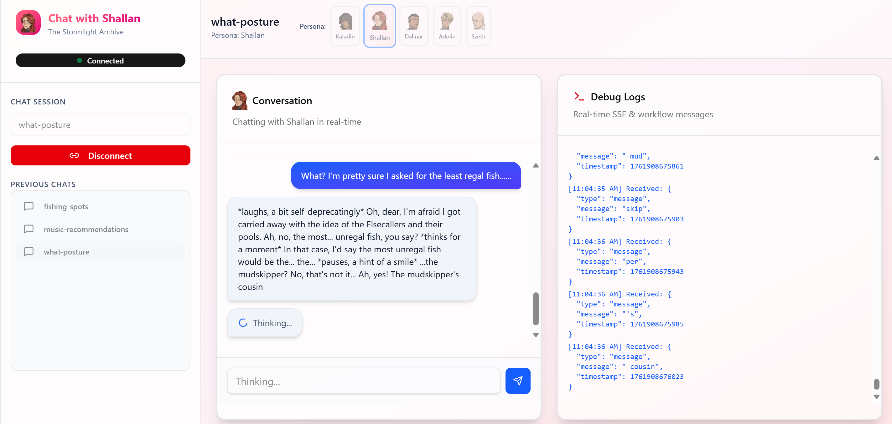
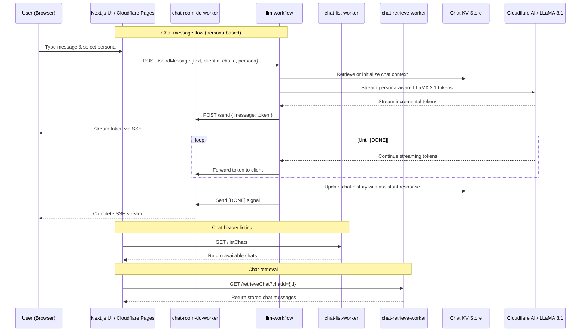

# 🌩️ Stormlight Chat

An intelligent, persona-driven chat application built entirely on the **Cloudflare Edge**, combining real-time conversation, LLM-powered responses, and rich character-based interactions inspired by *The Stormlight Archive*.

---

## 🌐 Live Demo

Check out the live Stormlight Chat application deployed on **Cloudflare Pages**:

[https://stormlight-chat.pages.dev/](https://stormlight-chat.pages.dev/)



> The frontend is fully static, fast, and globally distributed, while the backend leverages Cloudflare Workers, Durable Objects, Workflows, and KV for real-time AI chat functionality.


## ⚙️ Architecture Overview

Stormlight Chat runs fully serverlessly on the Cloudflare developer platform, offering **edge-native AI chat** with minimal latency.



### 🧩 Components

| Layer | Technology | Description |
|-------|------------|-------------|
| **Frontend** | [Next.js](https://nextjs.org) + [Jotai](https://jotai.org) | Interactive UI with reactive state for messages, personas, and session control. **Deployed as a static site on [Cloudflare Pages](https://pages.cloudflare.com/) for fast global delivery.** |
| **API Layer** | [Cloudflare Workers](https://developers.cloudflare.com/workers/) | REST endpoints, persona management, and LLM invocation logic. |
| **Streaming Engine** | [Durable Objects](https://developers.cloudflare.com/durable-objects/) | Maintains live HTTP/SSE streams for real-time chat updates. |
| **Background Jobs** | [Cloudflare Workflows](https://developers.cloudflare.com/workers/configuration/workflows/) | Executes LLM calls, token streaming, and state updates asynchronously. |
| **State Store** | [Cloudflare KV](https://developers.cloudflare.com/kv/) | Persists conversation history, persona info, and session metadata. |
| **AI Runtime** | [Cloudflare AI](https://developers.cloudflare.com/ai/) | Provides model inference for LLM-powered responses. |

---

## 🧠 Features

-  **Edge-native LLM chat** — ultra-low latency, globally distributed execution.  
-  **Real-time streaming** — token-level streaming from Durable Objects over SSE.  
- **Stormlight persona system** — chat with characters like Kaladin, Shallan, or Dalinar.  
-  **Persistent conversations** — chat state stored in Cloudflare KV.  
-  **Composable front-end** — powered by Jotai atoms and reusable UI primitives.  
- **Workflow orchestration** — background AI processes with resumable logic.  

---

## 🧱 Project Structure

# 🌩️ Stormlight Chat

An intelligent, persona-driven chat application built entirely on the **Cloudflare Edge** — combining real-time conversation, LLM-powered responses, and rich character-based interactions inspired by *The Stormlight Archive*.

---

## ⚙️ Architecture Overview

Stormlight Chat runs fully serverlessly on the Cloudflare developer platform, offering **edge-native AI chat** with minimal latency.

### 🧩 Components

| Layer | Technology | Description |
|-------|------------|-------------|
| **Frontend** | [Next.js](https://nextjs.org) + [Jotai](https://jotai.org) | Interactive UI with reactive state for messages, personas, and session control. **Deployed as a static site on Cloudflare Pages** for fast global delivery. |
| **API Layer** | [Cloudflare Workers](https://developers.cloudflare.com/workers/) | REST endpoints, persona management, and LLM invocation logic. |
| **Streaming Engine** | [Durable Objects](https://developers.cloudflare.com/durable-objects/) | Maintains live HTTP/SSE streams for real-time chat updates. |
| **Background Jobs** | [Cloudflare Workflows](https://developers.cloudflare.com/workers/configuration/workflows/) | Executes LLM calls, token streaming, and state updates asynchronously. |
| **State Store** | [Cloudflare KV](https://developers.cloudflare.com/kv/) | Persists conversation history, persona info, and session metadata. |
| **AI Runtime** | [Cloudflare AI](https://developers.cloudflare.com/ai/) | Provides model inference for LLM-powered responses. |

--- 

## 🧠 LLM & Persona Integration

Stormlight Chat uses **LLaMA 3.1 8B Instruct** via Cloudflare AI to power its assistant responses. Each chat session is personalized using the selected **Stormlight Archive persona**, ensuring the conversation stays in-character.

### How it works

1. **Persona Context:**  
   Each chat session stores a system message that defines the persona, e.g.:

   > "You are an assistant based on Kaladin from the Stormlight Archive. Always make references to Kaladin’s story in the books and never say something Kaladin wouldn’t say."

2. **Appending User Messages:**  
   When a user sends a message, it is immediately added to the KV-stored chat history.

3. **Streaming AI Response:**  
   - The LLaMA model is called with the full conversation history (system + user messages).  
   - Responses are **streamed token-by-token** through a Durable Object to the client in real time.

4. **State Persistence:**  
   - Completed assistant responses are appended to the chat history in KV.  
   - This enables the workflow to maintain context across multiple messages and sessions.

### Benefits

- Maintains **in-character responses** for immersive roleplay.  
- Supports **long-running conversations** without losing context.  
- Provides **low-latency streaming** for smooth, real-time chat experiences.


---

## 🧠 Features

- ⚡ **Edge-native LLM chat** — ultra-low latency, globally distributed execution.  
- 🧵 **Real-time streaming** — token-level streaming from Durable Objects over SSE.  
- 🧍‍♂️ **Stormlight persona system** — chat with characters like Kaladin, Shallan, or Dalinar.  
- 💾 **Persistent conversations** — chat state stored in Cloudflare KV.  
- 🧩 **Composable front-end** — powered by Jotai atoms and reusable UI primitives.  
- 🔄 **Workflow orchestration** — background AI processes with resumable logic.  

---

## 🧱 Project Structure
```
stormlight-chat/
├── app/
│   ├── globals.scss
│   ├── layout.tsx
│   ├── page.tsx
│   └── tailwind.css
│
├── atoms/                           #Jotai atoms
│   ├── chatLog.ts
│   ├── common.ts
│   └── debugLog.ts
│
├── components/
│   ├── stormlightchat/
│   │   ├── ChatCard.tsx
│   │   └── DebugCard.tsx
│   └── ui/(shadcn components)
│
├── lib/
│   └── utils.ts
│
├── public/
│   └── (static assets)
│
├── workers/
│   ├── audio-websocket/             # Worker handling bidirectional audio streaming
│   │   ├── worker.ts
│   │   └── wrangler.toml
│   │
│   ├── fetch-chats/                 # Worker for retrieving all chats for a user/session
│   │   ├── worker.ts
│   │   └── wrangler.toml
│   │
│   ├── model-worfklow/              # Cloudflare Workflow for orchestrating LLM calls + KV updates
│   │   ├── worker.ts
│   │   └── wrangler.toml
│   │
│   ├── retrieve-chat/               # Worker for fetching a single chat’s history/state
│   │   ├── worker.ts
│   │   └── wrangler.toml
│   │
│   ├── sse-do/                      # Durable Object managing SSE streaming sessions
│   │   ├── worker.ts
│   │   └── wrangler.toml
│   │
│   ├── chat.d.ts                    # Shared type definitions
│   └── tsconfig.json                # Worker build configuration
│
├── commands.sh # wrangler deploy commands
├── components.json
├── next.config.js
├── package.json
├── pnpm-lock.yaml
├── postcss.config.mjs
├── tsconfig.json
```
